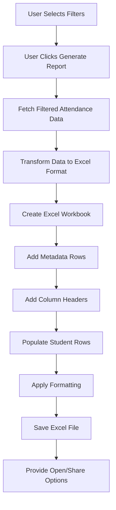

# Design Document: Teacher Attendance Excel Report

## Overview

This design document describes the implementation of Excel-based attendance report generation for teachers, replacing the existing PDF report system. The feature transforms the current PDF report generation into an Excel format that provides a detailed, column-based view of attendance data.

### Current System

The existing system (`AttendanceReportScreen`) generates PDF reports with:

- Tabular format showing student ID, present count, total count, and percentage
- Date range and time slot filtering
- Support for both new session-based records and legacy cumulative records
- Pagination for large datasets

### Proposed Changes

The new system will:

- Generate Excel (.xlsx) files instead of PDF files
- Display individual lecture dates as columns with P/A status for each student
- Maintain the same filtering capabilities (date range, time slots)
- Preserve backward compatibility with legacy attendance data
- Provide file sharing and opening capabilities

### Key Benefits

1. **Enhanced Data Analysis**: Excel format allows teachers to sort, filter, and analyze attendance patterns
2. **Detailed View**: Individual lecture dates visible as columns provide granular attendance information
3. **Data Manipulation**: Teachers can perform calculations and create custom views
4. **Integration**: Excel files can be imported into other systems or combined with other data

## Architecture

### Component Structure

```
AttendanceReportScreen (Modified)
├── UI Layer (Existing - Minimal Changes)
│   ├── Date range selection
│   ├── Time slot filtering
│   └── Report generation button (text updated)
│
├── Data Layer (Existing - Reused)
│   ├── AttendanceService
│   ├── Firestore queries
│   └── Legacy data handling
│
└── Report Generation Layer (New)
    ├── ExcelReportGenerator (New Service)
    │   ├── Data transformation
    │   ├── Excel file creation
    │   └── File storage and sharing
    │
    └── Excel Library (excel package)
        ├── Workbook creation
        ├── Cell formatting
        └── File export
```

### Data Flow



### Technology Stack

- **Flutter/Dart**: Application framework
- **excel ^4.0.6**: Excel file generation library
- **path_provider**: File system access for saving files
- **open_file**: Opening generated Excel files
- **Cloud Firestore**: Database for attendance records
- **intl**: Date formatting

## Components and Interfaces

### 1. ExcelReportGenerator Service

A new service class responsible for transforming attendance data into Excel format.

```dart
class ExcelReportGenerator {
  /// Generate Excel report from attendance data
  /// Returns the file path of the generated Excel file
  Future<String> generateExcelReport({
    required Map<String, Map<String, dynamic>> studentAttendance,
    required List<LectureSession> lectureSessions,
    required String courseName,
    required String semester,
    required DateTime startDate,
    required DateTime endDate,
    required List<String> selectedTimeSlotNames,
  });

  /// Create Excel workbook with metadata and headers
  Excel _createWorkbook();

  /// Add metadata rows (course info, filters)
  void _addMetadataRows(Sheet sheet, ...);

  /// Add column headers (student_id, dates, percentage)
  void _addColumnHeaders(Sheet sheet, List<DateTime> lectureDates);

  /// Populate student attendance rows
  void _populateStudentRows(Sheet sheet, ...);

  /// Apply formatting (bold headers, borders, alignment)
  void _applyFormatting(Sheet sheet);

  /// Save Excel file to device storage
  Future<String> _saveExcelFile(Excel excel, String filename);
}
```

### 2. LectureSession Model

A new model to represent individual lecture sessions with date and attendance data.

```dart
class LectureSession {
  final DateTime date;
  final String timeSlotId;
  final String timeSlotName;
  final Map<String, String> studentStatuses; // studentId -> 'P' or 'A'

  LectureSession({
    required this.date,
    required this.timeSlotId,
    required this.timeSlotName,
    required this.studentStatuses,
  });
}
```

### 3. Modified AttendanceReportScreen

The existing screen will be modified to:

- Replace PDF generation with Excel generation
- Update button text to "Generate Excel Report"
- Call `ExcelReportGenerator` instead of PDF generation logic
- Provide file opening/sharing options after generation

```dart
class _AttendanceReportScreenState extends State<AttendanceReportScreen> {
  final ExcelReportGenerator _excelGenerator = ExcelReportGenerator();

  Future<void> _generateReport() async {
    // Existing validation logic (unchanged)

    // Fetch filtered attendance data (existing logic)
    final attendanceData = await _fetchFilteredAttendanceData();
    final lectureSessions = await _fetchLectureSessions();

    // Generate Excel report (new)
    final filePath = await _excelGenerator.generateExcelReport(
      studentAttendance: attendanceData,
      lectureSessions: lectureSessions,
      courseName: widget.courseName,
      semester: widget.semester,
      startDate: _startDate!,
      endDate: _endDate!,
      selectedTimeSlotNames: _getSelectedTimeSlotNames(),
    );

    // Show success and provide file options (new)
    await _showFileOptions(filePath);
  }

  Future<List<LectureSession>> _fetchLectureSessions() async {
    // New method to fetch individual lecture sessions
  }

  Future<void> _showFileOptions(String filePath) async {
    // Show dialog with Open and Share options
  }
}
```

### 4. Data Transformation Logic

The system needs to transform session-based attendance data into a format suitable for Excel columns.

**Input**: Session-based records from Firestore

```
Session 1 (2024-01-15, Period 1):
  - Student A: P
  - Student B: A

Session 2 (2024-01-16, Period 1):
  - Student A: A
  - Student B: P
```

**Output**: Column-based Excel structure

```
| student_id | 2024-01-15 | 2024-01-16 | attendance_percentage |
|------------|------------|------------|-----------------------|
| Student A  | P          | A          | 50.00%                |
| Student B  | A          | P          | 50.00%                |
```

## Data Models

### Existing Models (Reused)

#### TimeSlot

```dart
class TimeSlot {
  final String id;
  final String displayName;
  final String startTime;
  final String endTime;

  // Existing implementation from current system
}
```

### New Models

#### LectureSession

```dart
class LectureSession {
  final DateTime date;
  final String timeSlotId;
  final String timeSlotName;
  final Map<String, String> studentStatuses; // studentId -> 'P' or 'A'

  LectureSession({
    required this.date,
    required this.timeSlotId,
    required this.timeSlotName,
    required this.studentStatuses,
  });

  /// Create from Firestore session document
  factory LectureSession.fromFirestore(
    DocumentSnapshot sessionDoc,
    Map<String, String> studentStatuses,
  ) {
    final data = sessionDoc.data() as Map<String, dynamic>;
    return LectureSession(
      date: _parseDate(data['date']),
      timeSlotId: data['time_slot_id'] ?? 'unknown',
      timeSlotName: data['time_slot_name'] ?? 'Unknown',
      studentStatuses: studentStatuses,
    );
  }

  static DateTime _parseDate(String dateStr) {
    // Parse YYYY-MM-DD format
    return DateFormat('yyyy-MM-dd').parse(dateStr);
  }
}
```

#### ExcelReportData

```dart
class ExcelReportData {
  final String courseName;
  final String semester;
  final DateTime startDate;
  final DateTime endDate;
  final List<String> selectedTimeSlotNames;
  final List<DateTime> lectureDates;
  final Map<String, StudentAttendanceRow> studentRows;

  ExcelReportData({
    required this.courseName,
    required this.semester,
    required this.startDate,
    required this.endDate,
    required this.selectedTimeSlotNames,
    required this.lectureDates,
    required this.studentRows,
  });
}

class StudentAttendanceRow {
  final String studentId;
  final Map<DateTime, String> dateStatuses; // date -> 'P' or 'A'
  final double attendancePercentage;

  StudentAttendanceRow({
    required this.studentId,
    required this.dateStatuses,
    required this.attendancePercentage,
  });
}
```

### Database Schema (Unchanged)

The feature uses the existing Firestore schema:

```
Attendance/
  {semester}/
    {courseName}/
      sessions/
        records/
          {sessionId}/  // Format: YYYYMMDD_timeSlotId
            date: "YYYY-MM-DD"
            time_slot_id: "1"
            time_slot_name: "Period 1"
            timestamp: Timestamp
            students/
              {studentId}/
                status: "P" or "A"

      {studentId}/  // Legacy cumulative records
        present: number
        total: number
        date: Timestamp
```

## Correctness Properties

_A property is a characteristic or behavior that should hold true across all valid executions of a system—essentially, a formal statement about what the system should do. Properties serve as the bridge between human-readable specifications and machine-verifiable correctness guarantees._

### Property 1: Excel File Generation with Correct Extension

_For any_ attendance report request with valid filters, the system should generate a file that exists on device storage and has a .xlsx extension.

**Validates: Requirements 1.1, 1.2, 1.4**

### Property 2: Column Structure Completeness

_For any_ generated Excel file, the columns should be: "student_id" as the first column, followed by lecture date columns in chronological order, followed by "attendance_percentage" as the last column.

**Validates: Requirements 2.1, 2.3, 2.4**

### Property 3: Lecture Date Column Correspondence

_For any_ date range filter and set of lecture sessions, the number of date columns in the Excel file should equal the number of unique lecture dates within the filtered range.

**Validates: Requirements 2.2, 4.3**

### Property 4: Date Format Consistency

_For any_ lecture date column header, the header should match a readable date format pattern (e.g., "YYYY-MM-DD" or "MMM DD, YYYY").

**Validates: Requirements 2.5**

### Property 5: Student Row Correspondence

_For any_ set of students with attendance records, the number of data rows in the Excel file should equal the number of unique students.

**Validates: Requirements 3.1**

### Property 6: Attendance Status Mapping

_For any_ student and lecture date combination, if the student was present, the corresponding cell should contain "P", and if absent, it should contain "A".

**Validates: Requirements 3.2, 3.3, 4.4**

### Property 7: Student Data Population

_For any_ student row in the Excel file, the student_id column should contain the correct student ID and the attendance_percentage column should contain the calculated percentage.

**Validates: Requirements 3.4, 3.5**

### Property 8: Percentage Format Consistency

_For any_ attendance percentage value, it should be formatted as a number with exactly two decimal places followed by a "%" symbol.

**Validates: Requirements 3.6**

### Property 9: Percentage Calculation Accuracy

_For any_ student, the attendance percentage should equal (number of lectures attended / total number of lectures) × 100, rounded to two decimal places.

**Validates: Requirements 4.5, 8.4**

### Property 10: Date Range Filtering

_For any_ date range filter, all lecture sessions included in the Excel file should have dates within the specified start and end dates (inclusive).

**Validates: Requirements 4.1, 8.2**

### Property 11: Time Slot Filtering

_For any_ set of selected time slots, all lecture sessions included in the Excel file should have time_slot_id values matching one of the selected time slots.

**Validates: Requirements 4.2, 8.3**

### Property 12: Legacy Data Inclusion

_For any_ report generation where the legacy time slot is selected, legacy attendance records should be included in the generated Excel file.

**Validates: Requirements 4.6**

### Property 13: Metadata Completeness

_For any_ generated Excel file, the metadata rows should include course name, semester, date range filter, and (if applicable) selected time slot names.

**Validates: Requirements 5.1, 5.2, 5.3, 5.4**

### Property 14: Metadata Positioning

_For any_ generated Excel file, all metadata rows should appear before the column header row, which should appear before the first data row.

**Validates: Requirements 5.5**

### Property 15: Metadata Visual Distinction

_For any_ metadata row, the cells should have formatting (such as bold) that visually distinguishes them from data rows.

**Validates: Requirements 5.6**

### Property 16: Loading State During Generation

_For any_ report generation in progress, the UI should display a loading indicator until generation completes or fails.

**Validates: Requirements 6.2**

### Property 17: Success Feedback

_For any_ successful Excel file generation, the system should display a success message to the user.

**Validates: Requirements 6.3**

### Property 18: Error Feedback with Details

_For any_ failed Excel file generation, the system should display an error message that includes details about the failure type (database, file creation, or storage).

**Validates: Requirements 6.4, 10.1, 10.2, 10.3, 10.4**

### Property 19: Filename Uniqueness

_For any_ two Excel files generated at different times, the filenames should be different to prevent overwrites.

**Validates: Requirements 7.4**

### Property 20: Filename Content Requirements

_For any_ generated Excel file, the filename should contain both the course name and a timestamp.

**Validates: Requirements 7.5**

### Property 21: File Accessibility

_For any_ generated Excel file, it should be stored in a directory that is accessible to the user and other applications.

**Validates: Requirements 7.3**

### Property 22: Student Set Consistency

_For any_ set of filter criteria, the students included in an Excel report should be the same students that would have been included in a PDF report with identical filters.

**Validates: Requirements 8.5**

### Property 23: Header Formatting

_For any_ column header cell or metadata cell, it should have bold formatting applied.

**Validates: Requirements 9.1, 9.2**

### Property 24: Cell Border Application

_For any_ data cell in the Excel file, it should have borders applied for readability.

**Validates: Requirements 9.3**

### Property 25: Column Auto-sizing

_For any_ column in the Excel file, the column width should be automatically sized to fit its content.

**Validates: Requirements 9.4**

### Property 26: Header Row Freeze

_For any_ generated Excel file, the header row should be frozen so it remains visible when scrolling vertically.

**Validates: Requirements 9.5**

### Property 27: Status Cell Alignment

_For any_ cell containing attendance status ("P" or "A"), the cell should have center alignment applied.

**Validates: Requirements 9.6**

### Property 28: Error Logging

_For any_ error that occurs during report generation, detailed error information should be logged for debugging purposes.

**Validates: Requirements 10.5**

## Error Handling

### Error Categories

1. **Data Retrieval Errors**
   - Database connection failures
   - Query execution failures
   - Firestore permission errors

2. **Data Validation Errors**
   - Invalid date ranges (start date after end date)
   - Missing required filters
   - Empty result sets

3. **File Generation Errors**
   - Excel library errors
   - Memory allocation failures
   - Invalid data format errors

4. **File Storage Errors**
   - Insufficient storage space
   - Permission denied errors
   - Path not found errors

5. **File Access Errors**
   - File opening failures
   - File sharing failures

### Error Handling Strategy

```dart
class ExcelReportGenerator {
  Future<String> generateExcelReport(...) async {
    try {
      // Validate inputs
      _validateInputs(startDate, endDate);

      // Fetch data with error handling
      final sessions = await _fetchSessionsWithRetry();

      // Generate Excel with error handling
      final excel = await _createExcelWorkbook(sessions);

      // Save file with error handling
      final filePath = await _saveExcelFileWithRetry(excel);

      return filePath;
    } on FirebaseException catch (e) {
      _logError('Database error', e);
      throw ExcelReportException(
        'Failed to retrieve attendance data from database',
        type: ErrorType.database,
        originalError: e,
      );
    } on FileSystemException catch (e) {
      _logError('File system error', e);
      throw ExcelReportException(
        'Failed to save Excel file to storage',
        type: ErrorType.storage,
        originalError: e,
      );
    } on ExcelException catch (e) {
      _logError('Excel generation error', e);
      throw ExcelReportException(
        'Failed to create Excel file',
        type: ErrorType.fileGeneration,
        originalError: e,
      );
    } catch (e) {
      _logError('Unexpected error', e);
      throw ExcelReportException(
        'An unexpected error occurred',
        type: ErrorType.unknown,
        originalError: e,
      );
    }
  }

  void _validateInputs(DateTime startDate, DateTime endDate) {
    if (startDate.isAfter(endDate)) {
      throw ExcelReportException(
        'Start date must be before or equal to end date',
        type: ErrorType.validation,
      );
    }
  }

  void _logError(String context, dynamic error) {
    debugPrint('ExcelReportGenerator Error [$context]: $error');
    // Additional logging to analytics/crash reporting service
  }
}

class ExcelReportException implements Exception {
  final String message;
  final ErrorType type;
  final dynamic originalError;

  ExcelReportException(
    this.message, {
    required this.type,
    this.originalError,
  });

  @override
  String toString() => message;
}

enum ErrorType {
  database,
  validation,
  fileGeneration,
  storage,
  fileAccess,
  unknown,
}
```

### User-Facing Error Messages

```dart
String _getErrorMessage(ExcelReportException error) {
  switch (error.type) {
    case ErrorType.database:
      return 'Unable to retrieve attendance data. Please check your connection and try again.';
    case ErrorType.validation:
      return error.message; // Use specific validation message
    case ErrorType.fileGeneration:
      return 'Failed to create Excel file. Please try again.';
    case ErrorType.storage:
      return 'Unable to save file. Please check available storage space.';
    case ErrorType.fileAccess:
      return 'Unable to open or share the file. Please check app permissions.';
    case ErrorType.unknown:
      return 'An unexpected error occurred. Please try again.';
  }
}
```

### Empty Data Handling

```dart
Future<void> _generateReport() async {
  // ... validation ...

  final attendanceData = await _fetchFilteredAttendanceData();

  if (attendanceData.isEmpty) {
    ScaffoldMessenger.of(context).showSnackBar(
      SnackBar(
        content: Text('No attendance records found for the selected criteria'),
        action: SnackBarAction(
          label: 'Adjust Filters',
          onPressed: () {
            // Scroll to filter section or highlight filters
          },
        ),
      ),
    );
    return;
  }

  // Continue with report generation
}
```

## Testing Strategy

### Dual Testing Approach

This feature requires both unit testing and property-based testing to ensure comprehensive coverage:

- **Unit tests**: Verify specific examples, edge cases, and error conditions
- **Property tests**: Verify universal properties across all inputs

### Unit Testing

Unit tests should focus on:

1. **Specific Examples**
   - Generate report with known data and verify exact output
   - Test empty lecture date scenario (edge case from 2.6)
   - Test single student, single lecture scenario
   - Test legacy data inclusion with specific legacy records

2. **Integration Points**
   - Verify ExcelReportGenerator integrates with AttendanceService
   - Test file opening and sharing mechanisms
   - Verify UI state transitions (loading, success, error)

3. **Error Conditions**
   - Test behavior when database query fails
   - Test behavior when file system is full
   - Test behavior with invalid date ranges
   - Test behavior with malformed data

4. **Edge Cases**
   - Empty student list
   - Empty lecture date list (Requirement 2.6)
   - Very large datasets (100+ students, 50+ lecture dates)
   - Special characters in course names
   - Leap year dates
   - Date range spanning multiple months/years

Example unit tests:

```dart
void main() {
  group('ExcelReportGenerator', () {
    test('generates file with correct extension', () async {
      final generator = ExcelReportGenerator();
      final filePath = await generator.generateExcelReport(
        studentAttendance: mockStudentData,
        lectureSessions: mockSessions,
        courseName: 'CS101',
        semester: 'Fall 2024',
        startDate: DateTime(2024, 1, 1),
        endDate: DateTime(2024, 1, 31),
        selectedTimeSlotNames: [],
      );

      expect(filePath.endsWith('.xlsx'), true);
    });

    test('handles empty lecture dates correctly', () async {
      // Edge case from Requirement 2.6
      final generator = ExcelReportGenerator();
      final filePath = await generator.generateExcelReport(
        studentAttendance: mockStudentData,
        lectureSessions: [], // No lectures
        courseName: 'CS101',
        semester: 'Fall 2024',
        startDate: DateTime(2024, 1, 1),
        endDate: DateTime(2024, 1, 31),
        selectedTimeSlotNames: [],
      );

      final excel = Excel.decodeBytes(File(filePath).readAsBytesSync());
      final sheet = excel.tables.keys.first;
      final headers = excel.tables[sheet]!.rows.first;

      // Should only have student_id and attendance_percentage columns
      expect(headers.length, 2);
      expect(headers[0]?.value, 'student_id');
      expect(headers[1]?.value, 'attendance_percentage');
    });
  });
}
```

### Property-Based Testing

Property tests should verify universal properties across randomized inputs. The feature should use **fast_check** (for Dart/Flutter via JS interop) or implement property testing using the **test** package with custom generators.

**Configuration**: Each property test must run a minimum of 100 iterations.

**Tagging**: Each property test must reference its design document property using the format:

```dart
// Feature: teacher-attendance-excel-report, Property 1: Excel File Generation with Correct Extension
```

Example property tests:

```dart
import 'package:test/test.dart';

void main() {
  group('Property Tests', () {
    // Feature: teacher-attendance-excel-report, Property 3: Lecture Date Column Correspondence
    test('number of date columns equals number of unique lecture dates', () async {
      for (int i = 0; i < 100; i++) {
        // Generate random lecture sessions
        final sessions = generateRandomLectureSessions();
        final uniqueDates = sessions.map((s) => s.date).toSet();

        final generator = ExcelReportGenerator();
        final filePath = await generator.generateExcelReport(
          studentAttendance: generateRandomStudentData(),
          lectureSessions: sessions,
          courseName: 'TestCourse',
          semester: 'TestSem',
          startDate: DateTime(2024, 1, 1),
          endDate: DateTime(2024, 12, 31),
          selectedTimeSlotNames: [],
        );

        final excel = Excel.decodeBytes(File(filePath).readAsBytesSync());
        final sheet = excel.tables.keys.first;
        final headers = excel.tables[sheet]!.rows.first;

        // Column count = 1 (student_id) + uniqueDates.length + 1 (percentage)
        expect(headers.length, equals(uniqueDates.length + 2));
      }
    });

    // Feature: teacher-attendance-excel-report, Property 9: Percentage Calculation Accuracy
    test('attendance percentage calculation is accurate', () async {
      for (int i = 0; i < 100; i++) {
        final sessions = generateRandomLectureSessions();
        final studentData = generateRandomStudentData();

        final generator = ExcelReportGenerator();
        final filePath = await generator.generateExcelReport(
          studentAttendance: studentData,
          lectureSessions: sessions,
          courseName: 'TestCourse',
          semester: 'TestSem',
          startDate: DateTime(2024, 1, 1),
          endDate: DateTime(2024, 12, 31),
          selectedTimeSlotNames: [],
        );

        final excel = Excel.decodeBytes(File(filePath).readAsBytesSync());
        final sheet = excel.tables.keys.first;

        // Verify each student's percentage
        for (var studentId in studentData.keys) {
          final row = findStudentRow(excel, sheet, studentId);
          final percentage = extractPercentage(row.last);

          final present = studentData[studentId]!['present'] as int;
          final total = studentData[studentId]!['total'] as int;
          final expected = total > 0 ? (present * 100 / total) : 0.0;

          expect(percentage, closeTo(expected, 0.01));
        }
      }
    });

    // Feature: teacher-attendance-excel-report, Property 10: Date Range Filtering
    test('all lecture dates are within specified date range', () async {
      for (int i = 0; i < 100; i++) {
        final startDate = generateRandomDate();
        final endDate = startDate.add(Duration(days: random.nextInt(90)));
        final sessions = generateRandomLectureSessions(
          minDate: startDate.subtract(Duration(days: 30)),
          maxDate: endDate.add(Duration(days: 30)),
        );

        final generator = ExcelReportGenerator();
        final filePath = await generator.generateExcelReport(
          studentAttendance: generateRandomStudentData(),
          lectureSessions: sessions,
          courseName: 'TestCourse',
          semester: 'TestSem',
          startDate: startDate,
          endDate: endDate,
          selectedTimeSlotNames: [],
        );

        final excel = Excel.decodeBytes(File(filePath).readAsBytesSync());
        final sheet = excel.tables.keys.first;
        final headers = excel.tables[sheet]!.rows.first;

        // Extract date columns (skip first and last)
        final dateHeaders = headers.sublist(1, headers.length - 1);

        for (var dateCell in dateHeaders) {
          final date = parseDateFromHeader(dateCell?.value);
          expect(date.isAfter(startDate.subtract(Duration(days: 1))), true);
          expect(date.isBefore(endDate.add(Duration(days: 1))), true);
        }
      }
    });
  });
}

// Helper functions for property testing
List<LectureSession> generateRandomLectureSessions({
  DateTime? minDate,
  DateTime? maxDate,
}) {
  final random = Random();
  final count = random.nextInt(20) + 1;
  final sessions = <LectureSession>[];

  for (int i = 0; i < count; i++) {
    sessions.add(LectureSession(
      date: generateRandomDateBetween(
        minDate ?? DateTime(2024, 1, 1),
        maxDate ?? DateTime(2024, 12, 31),
      ),
      timeSlotId: '${random.nextInt(6) + 1}',
      timeSlotName: 'Period ${random.nextInt(6) + 1}',
      studentStatuses: generateRandomStatuses(),
    ));
  }

  return sessions;
}

Map<String, Map<String, dynamic>> generateRandomStudentData() {
  final random = Random();
  final count = random.nextInt(30) + 1;
  final data = <String, Map<String, dynamic>>{};

  for (int i = 0; i < count; i++) {
    final total = random.nextInt(20) + 1;
    final present = random.nextInt(total + 1);
    data['STUDENT_${i.toString().padLeft(3, '0')}'] = {
      'present': present,
      'total': total,
    };
  }

  return data;
}
```

### Test Coverage Goals

- **Unit Test Coverage**: Minimum 80% code coverage
- **Property Test Coverage**: All 28 correctness properties must have corresponding property tests
- **Integration Test Coverage**: End-to-end flows for report generation, file opening, and file sharing
- **Error Path Coverage**: All error types must be tested

### Testing Tools

- **test**: Dart's standard testing framework
- **mockito**: For mocking Firestore and file system operations
- **flutter_test**: For widget testing
- **integration_test**: For end-to-end testing
- Custom property test generators for randomized testing
